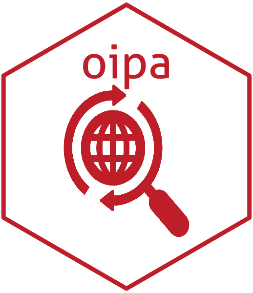

<!-- README.md is generated from README.Rmd. Please edit that file -->

# oipa: An R Interface to the Openaid International Aid Transparency Initiative Parser and API 

[](https://www.tidyverse.org/lifecycle/#experimental)
[](https://cran.r-project.org/package=oipa)
[](https://travis-ci.org/validmeasures/oipa)
[](https://ci.appveyor.com/project/validmeasures/oipa)
[](https://codecov.io/github/validmeasures/oipa?branch=master)

The [International Aid Transparency Initiatives
(IATI)](https://iatistandard.org/) is a global aid transparency standard
and it makes information about aid spending easier to access, use and
understand using a unified open standard. [Openaid IATI Parser and
Application Programming Interface (OIPA)](https://www.oipa.nl/) enables
IATI standard compliant dadtasets to easily parse and interface that
data using API that has been developed on the Django framework. This
package provides an R interface to the OIPA.

## Installation

You can install `oipa` from GitHub with:

``` r
# install.packages("devtools")
devtools::install_github("validmeasures/oipa")
```
